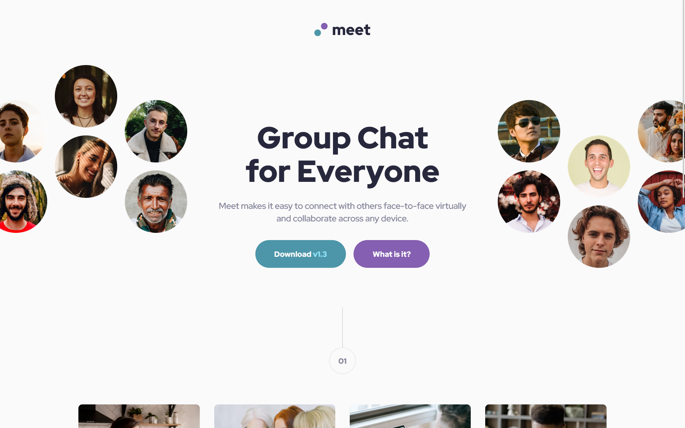
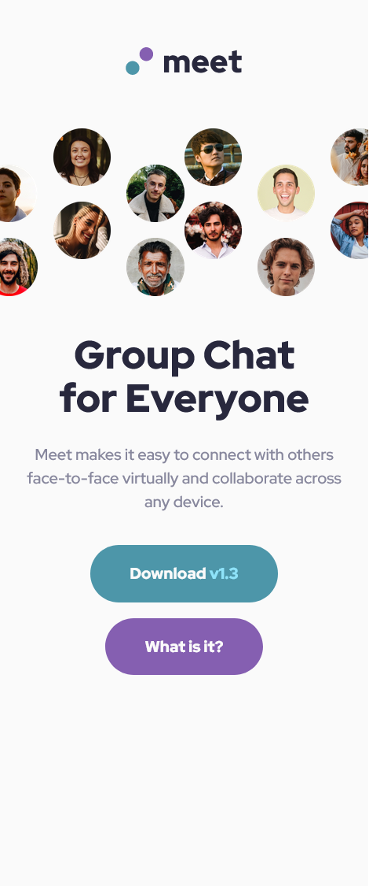

# Frontend Mentor - Meet landing page solution

This is a solution to the [Meet landing page challenge on Frontend Mentor](https://www.frontendmentor.io/challenges/meet-landing-page-rbTDS6OUR). Frontend Mentor challenges help you improve your coding skills by building realistic projects. 

## Table of contents

- [Overview](#overview)
  - [The challenge](#the-challenge)
  - [Screenshot](#screenshot)
  - [Links](#links)
- [My process](#my-process)
  - [Built with](#built-with)
  - [What I learned](#what-i-learned)
  - [Continued development](#continued-development)
  - [Useful resources](#useful-resources)
- [Author](#author)
- [Acknowledgments](#acknowledgments)

## Overview

### The challenge

Users should be able to:

- View the optimal layout depending on their device's screen size
- See hover states for interactive elements

### Screenshot

#### Desktop view

#### Tablet view

#### Mobile view

### Links

- [Solution URL](https://github.com/fmanimashaun/meet-landing-page)
- [Live Site URL]( https://fmanimashaun.github.io/meet-landing-page/)

## My process

### Built with

- [HTML](https://developer.mozilla.org/en-US/docs/Web/HTML)
- [CSS](https://developer.mozilla.org/en-US/docs/Web/CSS)
- [JavaScript/ES6](https://262.ecma-international.org/6.0/)
- [Git](https://git-scm.com/)
- [GitHub](https://github.com)
- [Figma](https://www.figma.com/)
- [webpack 5](https://webpack.js.org/)
- [sass](https://sass-lang.com/)

### What I learned

Basically, I worked to reinforced my knowledge of interpreting UI/UX design and implemeenting the  layout as close as possible to the design.

### Continued development

I will still want to focus on reinforcing my understanding of various layout implementation while learning javascript for use in future projects

### Useful resources

------

## Author

👤 **Engr. Animashaun Fisayo**

- [GitHub](https://github.com/fmanimashaun)
- [Twitter](https://twitter.com/fmanimashaun)
- [LinkedIn](https://www.linkedin.com/in/fmanimashaun/)
- [Website](https://fmanimashaun.com)
- [Blog](https://blog.fmanimashaun.com)

## Acknowledgments

------
